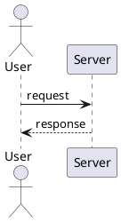
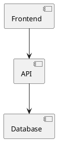
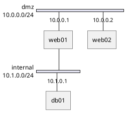
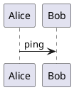

# Diagram Rendering Fixture

Exercises every diagram path mdp handles so a headless browser can confirm each
one renders to a visible image. Four fences produce five images (the last fence
holds two diagrams).

## Sequence diagram

A named `@startuml` block — the name token must be harmless under `-pipe`.

## Component diagram

## Network diagram (nwdiag)

A non-UML sub-language: must pass through verbatim, not get wrapped in
`@startuml`.

## Two diagrams in one fence

Both must render as separate images instead of one concatenated, invalid SVG.

